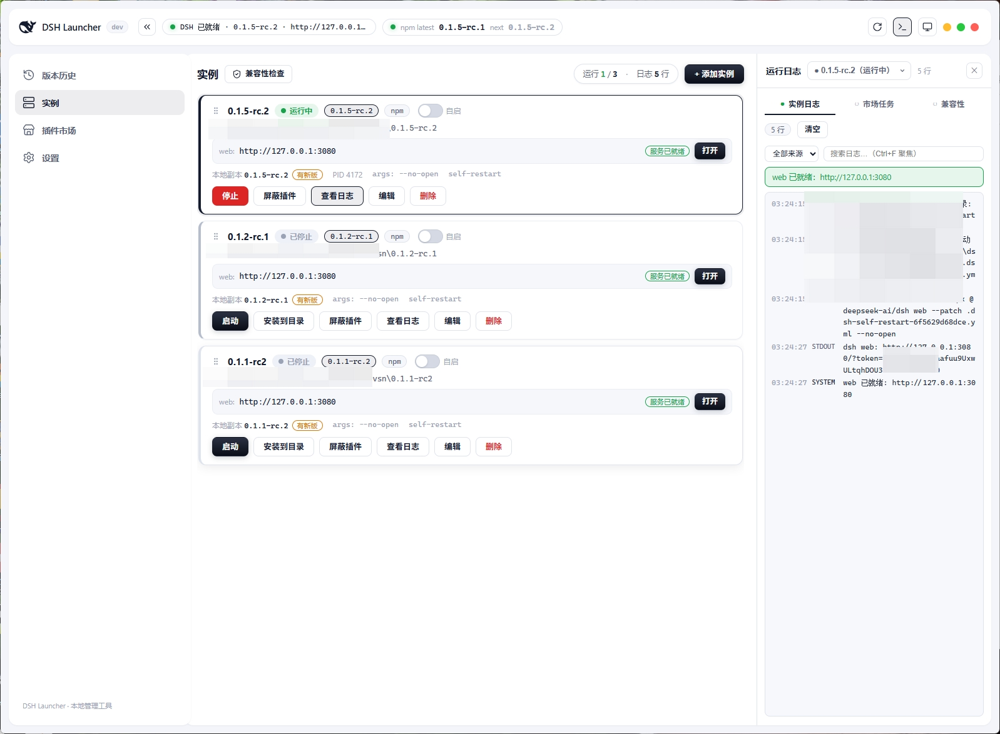
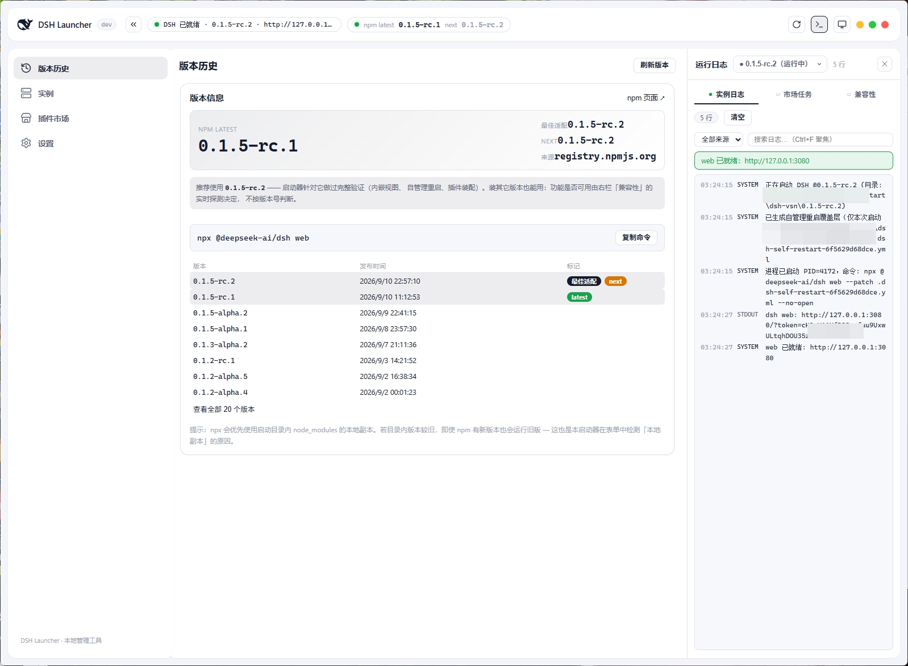
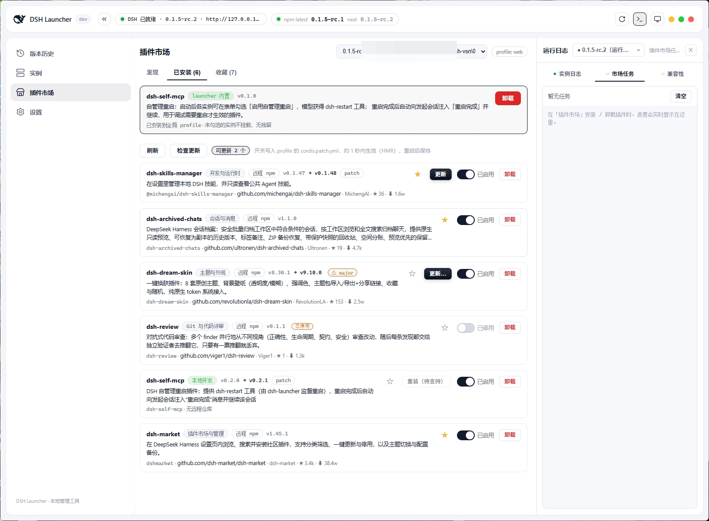
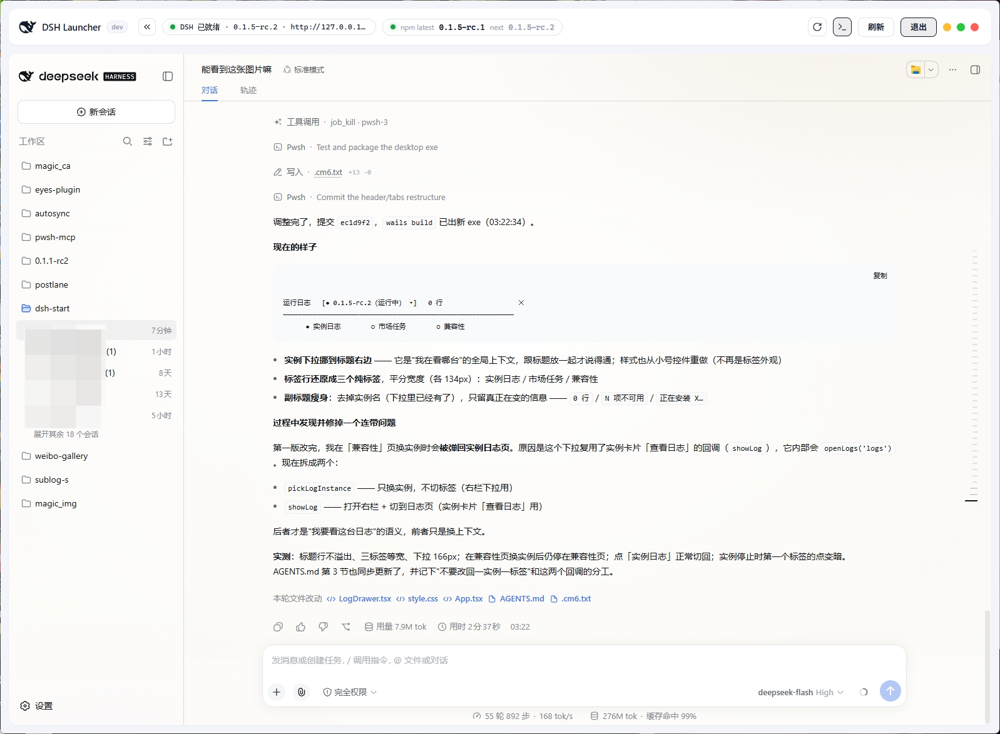

# DSH Launcher

一个 **跨平台桌面 GUI 启动器**（Windows / macOS / Linux），用于以「指定目录 + 指定版本」的方式启动
**DeepSeek Harness（DSH）**，并可视化地查询版本、管理实例、装配插件、查看实时日志。

DSH 的启动方式本质是一条 `npx -y @deepseek-ai/dsh@<版本> web` 命令（在某个工作目录里运行）。
启动器把「选目录 + 选版本 + 启动/停止 + 配插件 + 看日志」封装成开箱即用的图形界面，
还能把 DSH 界面直接**嵌进自己的窗口**当伪桌面版用。

[](https://github.com/wishesl/dsh-launcher/releases)

## 界面预览

**实例管理**（一个实例 = 一个目录 + 一个版本；卡片可拖拽排序，标题右侧是「兼容性检查」入口）：



**版本历史**（npm `latest` / `next` / 全部版本与发布时间；「最佳适配」是启动器实测验证过的版本）：



**插件市场 · 已安装**（逐个启用 / 禁用，开关写入 profile 补丁层，约 1 秒 HMR 生效、重启保持）：



**内置 DSH 视图**（把 DSH 界面嵌进启动器窗口 —— 顶栏保留刷新 / 退出，其余整块让给 DSH）：



> 更早版本的界面截图保留在 [`doc/`](doc/) 下，仅作历史记录（界面已经改过多轮）。

## 核心亮点：不启动 DSH，安全地管理一切

把 DSH 装好、配好、插件调好，再干干净净地启动——**整个过程不需要先打开 DSH**：

- **插件管理（不开 web）**：市场里发现 / 安装 / 卸载 / 启用 / 禁用插件，操作进度实时可见；
  开关直接写入 profile 的补丁层（约 1 秒 HMR 生效、重启保持）；还能离线收藏插件、生成 / 导入分享码。
- **本体管理（不开 web）**：可视化查询 npm `latest` / `next` / 全部版本与发布时间；
  「安装到目录」把指定版本真实装进目录 `node_modules`（pnpm 安装 + 自动批准原生模块构建），
  agent 可读源码；也可以「源码启动」直接跑源码目录（初始化 / 构建 / 启动命令一键执行）。
- **实例级插件屏蔽**：给每个实例单独勾选要屏蔽的插件——启动时注入**临时 `--patch` 覆盖层**，
  只对这一次启动生效，**不改全局开关状态**，实例停止后自动恢复；已卸载的插件自动不展示、不屏蔽。
- **安全第一**：插件安装 / 卸载 / 开关都要求实例处于停止状态（绝不边运行边改插件文件）；
  屏蔽走临时覆盖层而非改写全局配置；卸载自动清理禁用痕迹。

> 简单说：**选目录 → 装版本 → 配插件 → 点启动**，全程图形化，不开一条命令行，也不提前启动 DSH。

## 内置 DSH 视图（伪桌面版）

顶栏点显示器图标，下半区整块换成 DSH 网页，菜单与运行日志两栏让位 —— 看起来就像一个原生桌面版 DSH。
顶栏只保留「刷新 / 退出」两个按钮，其余空间全给 DSH；按 `Esc` 也能退出。

**地址从哪来**：DSH 每次启动都会新发一个带 token 的会话地址并只打印在启动日志里，
启动器从实例的启动过程里**自动解析**它，不需要手动粘贴。地址里的 token 在界面上是打码的
（只在 iframe 内部使用）。

**前置条件**（三条都满足才能内嵌）：

1. 实例由**启动器启动**（地址来自它的启动日志）；
2. 该实例勾选了「自管理重启」；
3. 全局已安装内置插件 `dsh-self-mcp`。

第 2、3 条不是形式要求：DSH 的会话 cookie 是 `SameSite=Strict`，跨源 iframe 里拿不到它，
不放宽就是永久 401。内置插件只做**最小放宽**——仅对「带有效 launch token 的首页请求」和
「来自启动器源的 `/api` 请求」放行，其它来源照旧被 Host/Origin 栅栏与 `Sec-Fetch-Site` 挡住。

> 条件不满足时入口会**置灰并说明原因**，而不是让你点进去看着它一直重连。

## 兼容性探测：让「上游改了内部实现」不再静默失效

DSH 迭代很快，启动器有几处必然咬住它内部实现的地方（启动日志格式、`connection` 上的认证方法、
Cordis 装载配置……）。这些耦合点**按能力探测，不按版本号判断**：版本号是上游控制的时间戳，
用户装的是 `latest`，任何「版本 → 启用什么」的对照表都必然滞后一步。

探测结论有明确的出口，集中在右栏第三个标签「兼容性」，另有实例页标题右侧的「兼容性检查」入口
（有问题的实例数直接落在按钮上）：

- 逐条列出**探测证据**：能否解析出访问地址 / 带 token 的地址、插件装配门控卡在哪一道、
  插件是否真的装载、`dsh-restart` 是否注册成功、会话校验是否放宽、重启完成的投递通道……
- 每行是**三态**：绿（可用）、红（**确定**的故障）、灰（没有结论 / 不适用）。
  区分"失败"和"不知道"是刻意的——面板一旦误报，用户就会学会无视它。
- 出问题时的表现从「点了没反应 / 一直转圈」变成「哪一项红了 + 为什么 + 什么后果」。

**最佳适配版本**是同一套思路的另一面：启动器会标出自己**实测验证过**的 DSH 版本
（版本列表打标签、实例表单里标注并在偏离时给一句提示），但它是**推荐，不是许可** ——
能不能用始终由上面的实时探测决定，装别的版本照样能启动。

## 快速上手

1. **准备环境**：运行 DSH 需要 Node.js（推荐 pnpm）；构建本应用需要 [Wails v2 CLI](https://wails.io/docs/gettingstarted/installation) + Go 1.25+。
   Linux 还需系统依赖（Debian/Ubuntu）：`sudo apt install libgtk-3-dev libwebkit2gtk-4.1-dev libsoup-3.0-dev libayatana-appindicator3-dev librsvg2-dev`，
   且构建时加 `-tags webkit2_41`（`wails build -tags webkit2_41`，Ubuntu 24.04 已移除 webkit2gtk-4.0）。
   启动器「设置」面板可一键检测 npm / pnpm 是否可用并安装 pnpm。
2. **获取应用**：直接下载 [Releases](https://github.com/wishesl/dsh-launcher/releases) 里对应平台的安装包
   （Windows `dsh-launcher-windows-amd64.exe` / macOS `dsh-launcher-darwin-*.zip` / Linux `dsh-launcher-linux-amd64.tar.gz`，无需安装）；
   或克隆仓库后 `cd dsh-launcher && wails build` 自行构建。
3. **添加实例**：左侧「实例」→「+ 添加实例」→ 选择 DSH 启动目录（例如你的项目目录）→
   选版本（「最新版」或指定版本）→ 启动方式选 **本地副本**（官方推荐，agent 可读真实源码）→ 保存。
4. **启动与打开**：卡片点「启动」，右侧运行日志面板自动弹出并实时滚动；顶部出现
   「DSH 已就绪 · 名称 · 地址」后点它即可在浏览器打开 DSH web（地址也可点卡片 URL 复制）。
5. **安装到目录**：若实例提示「本地副本未安装」，先点卡片「安装到目录」把该版本真实装进
   目录的 `node_modules`，避免 npx 反复联网拉取、也能让 agent 读到源码。
6. **开启自管理重启**（可选，用于插件调试）：实例表单勾选「自管理重启」，
   并在插件市场把内置插件 `dsh-self-mcp` 安装到全局。之后模型就能调用 `dsh-restart` 工具重启
   DSH，重启完成后启动器会自动把「重启完成」消息投回发起会话，让对话继续。
7. **用内置视图打开 DSH**（可选）：顶栏显示器图标 → 下半区变成 DSH 界面；`Esc` 或顶栏「退出」返回。
8. **停止 / 重启**：卡片「停止」结束进程；顶部 ↻ 按钮一键重启当前实例。
9. **日常习惯**：点 ✕ 默认最小化到托盘（DSH 继续后台运行），从托盘图标可唤回/退出；
   实例卡片可单独开启「自启」，打开启动器时自动拉起。

> 提示：DSH 本质是 `npx -y @deepseek-ai/dsh@<版本> web` 运行在选定目录里，多个实例互不干扰；
> 一个目录对应一个版本，别混着用（详见 `DSH版本查询与升级指南.md`）。

## 为什么做这个（背景）

参考 `DSH版本查询与升级指南.md`，主要解决两个痛点：

1. **npx 会优先命中启动目录里的本地 `node_modules` 副本**，
   导致「明明 npm 有新版本，本机却一直在跑旧版」。
2. 版本查询/升级要敲一堆命令行（`npm view` / `npx ... web`），容易记错。

启动器的价值：

- 一个实例 = **一个目录 + 一个版本**，多个实例互不干扰（对应指南「版本别混着用」）。
- 可视化显示 **npm 最新版 / 全部版本 / 发布时间 / 本地实际版本**，避免记忆偏差。
- 一键启动/停止，日志实时回显，不再手敲 npx 命令。

## 功能特性

- **实例管理**：每个实例绑定一个目录和一个版本；卡片式列表，带状态指示灯
  （starting / running / ready / stopped / crashed），支持 启动 / 停止 / 删除 / 打开网页。
  卡片可**拖拽排序**（键盘 ↑/↓ 等价），顺序落盘、托盘菜单同步。
- **版本查询**：展示 `latest`、`next` dist-tag、全部版本历史与发布时间；标注**最佳适配版本**；
  本地实际版本通过读取 `目录/node_modules/@deepseek-ai/dsh/package.json` 探测。
  版本来源：**官方 registry 优先，npmmirror 兜底**。
- **启动方式**：`npx -y @deepseek-ai/dsh@<version> web`，默认/推荐「本地副本（local）」，
  并支持一键「安装到目录」，避免 npx 反复联网拉取。
- **源码启动模式**：选择 DSH 源码目录，初始化 / 构建 / 启动命令可自定义
  （默认 `pnpm install` / `pnpm run build` / `pnpm dsh web`），一键执行。
- **内置 DSH 视图**：把 DSH 界面嵌进启动器窗口当伪桌面版用；地址从启动日志自动解析，token 打码，
  前置条件不满足时入口置灰并说明原因（见上文专节）。
- **自管理重启**：实例级开关 + 内置插件 `dsh-self-mcp` 提供 `dsh-restart` 工具；
  重启完成后自动向发起会话注入「重启完成」消息并唤醒它继续执行（以插件通知形式折叠显示，不是用户气泡）。
- **兼容性探测**：右栏「兼容性」标签 + 实例页「兼容性检查」入口，逐条列出各项能力的探测结论与证据，
  三态（可用 / 确定故障 / 没有结论），把静默失效变成一眼可见（见上文专节）。
- **插件市场**：发现 / 安装 / 卸载社区插件（复用官方 `dsh plugin --profile web` 通道），
  启用 / 禁用直接写 profile 的 `cordis.patch.yml`（HMR 约 1 秒生效、重启保持）；
  操作进度实时显示在右侧日志面板，支持镜像源配置与网络代理。
- **插件收藏与分享**：离线收藏插件（收藏文件在本地，断网也能安装），生成 / 导入分享码批量分享。
- **实例级插件屏蔽**：每实例勾选要屏蔽的插件，启动时注入临时 `--patch` 覆盖层，
  不改全局开关状态、实例停止后自动恢复；已卸载插件自动不展示、不屏蔽。
- **实时日志**：启动日志流式回显；就绪感知（自动识别 Web 地址）、崩溃与正常退出区分、
  自动启动时日志持久化、退出后清理残留的孤儿 DSH 进程。
- **三栏布局**：菜单 | 内容 | 运行日志，两条缝隙**可拖拽调宽**（双击复位），宽度存在 `settings.json`；
  右栏第一个标签是实例日志（标题旁下拉切换实例），后两个是市场任务与兼容性。
- **隐藏到系统托盘**：点窗口 ✕ 默认隐藏到托盘而非退出（可关闭）；托盘图标 + 菜单
  （显示主界面 / 隐藏 / 退出），设置持久化。
- **单点打开（单实例）**：重复启动 exe 不会开第二个窗口/第二个托盘图标，
  只会把已运行实例的窗口唤回前台。
- **前置环境设置**：Settings 面板检测 npm / pnpm 是否可用及版本，可一键安装/升级 pnpm。
- **自启与退出选择**：实例卡片可单独开启「开机自动启动」；点 ✕ 时弹窗选择
  「隐藏到托盘」或「直接退出」。

## 技术栈

| 层 | 技术 |
|---|---|
| 桌面壳 / 后端 | **Wails v2** + **Go 1.25**（Windows / macOS / Linux 三端） |
| 前端 | **React 18** + **TypeScript** + **Vite 3** |
| 系统托盘 | `fyne.io/systray`（独立 goroutine 跑消息循环，三端通用） |
| 单实例 | Wails `options.SingleInstanceLock` |
| 跨平台进程管理 | 平台抽象层（`procattr_windows.go` / `procattr_unix.go`）：Windows 走 `cmd /c` + Job Object + taskkill；macOS/Linux 走 `sh -c` + Setsid 进程组杀树 |
| 内置插件 | `dsh-self-mcp`（Cordis 插件，源码内嵌进 launcher 二进制，可一键安装到 profile） |

## 架构与目录结构

```
dsh-launcher/
├── main.go            # 应用入口：窗口/托盘/单实例锁/绑定
├── app.go             # App 生命周期 + 实例增删改查等绑定方法
├── version.go         # 启动器版本 + 最佳适配的 DSH 版本（都是 ldflags 可覆盖的变量）
├── instances.go       # 实例持久化（%APPDATA%\DSHLauncher\instances.json）
├── instance_mask.go   # 实例级插件屏蔽（名单持久化 + 临时 --patch 覆盖层生成/清理）
├── self_restart.go    # 自管理重启契约（双门控、覆盖层、restart-request.json 消费）
├── self_restart_install.go # 内置插件 dsh-self-mcp 的解出与安装（embed.FS → profile）
├── embeddata.go       # 内置插件源码的 embed 声明
├── capabilities.go    # 兼容性探测（读插件能力报告 + 启动器侧探针 → 面板数据）
├── dsh_query.go       # 版本查询（npm registry / 本地版本探测）
├── dsh_process.go     # 进程管理（npx/pnpm 启动、进程树停止、日志推送、就绪探测、地址/token 解析）
├── dsh_job_windows.go # Windows 进程树管理（Job Object / taskkill）
├── dsh_job_other.go   # 其它平台的空实现
├── install.go         # 「安装到目录」（pnpm 安装 + 批准原生模块构建）
├── market_catalog.go  # 插件市场目录拉取（镜像源 / ETag 缓存）
├── market_ops.go      # 插件安装 / 卸载（复用官方 dsh plugin CLI）
├── market_installed.go# 已装插件读取与启用/禁用（写 cordis.patch.yml 补丁层）
├── market_update.go   # 插件更新检查与执行（含内置插件）
├── favorites.go       # 插件收藏与分享码
├── service_probe.go   # 独立端口服务探测（驱动「已就绪」+ 打开按钮）
├── proxy.go           # 网络代理（npm/pnpm/git/registry）
├── env.go             # 前置环境检测（npm/pnpm）与 pnpm 安装
├── settings.go        # 设置持久化（布局、三栏宽度、托盘行为等）
├── logging.go         # 实例日志落盘
├── tray.go            # 系统托盘
├── procattr_*.go      # 平台进程属性 / 杀进程树
├── embed/dsh-self-mcp/ # 内置插件源码（Cordis 插件，见其 README）
└── frontend/
    └── src/
        ├── App.tsx / api.ts / types.ts / util.ts
        └── components/
            ├── Header.tsx / Sidebar.tsx / WinControls.tsx  # 顶栏 / 左侧菜单 / 窗口按钮
            ├── InstancesView.tsx / InstanceCard.tsx / InstanceForm.tsx
            ├── MaskPluginsDialog.tsx           # 实例「屏蔽插件」选择弹窗
            ├── VersionView.tsx / VersionPanel.tsx  # 版本历史
            ├── MarketView.tsx                  # 插件市场（发现 / 已安装 / 收藏）
            ├── LogDrawer.tsx / LogPanel.tsx    # 右侧运行日志第三栏（含兼容性面板）
            ├── Resizer.tsx                     # 三栏宽度拖拽
            ├── SettingsView.tsx                # 设置
            └── ExitDialog.tsx / ShareCodeDialog.tsx / Switch.tsx
    └── wailsjs/                    # Wails 自动生成的前端绑定
```

后端通过 `window.go.main.App.*` 暴露绑定方法给前端，事件走 `window.runtime.EventsOn/Off`：

| 事件 | 载荷 | 用途 |
|---|---|---|
| `dsh:log` | `LogEvent` | 实例日志行 |
| `dsh:status` | `StatusEvent` | 实例状态变化 |
| `dsh:service` | `ServiceState` | 服务可达性（驱动「DSH 已就绪」） |
| `dsh:notice` | `NoticeEvent` | 顶部 toast |
| `dsh:market-log` | `MarketLogEvent` | 市场操作输出行 |
| `dsh:market-status` | `MarketStatusEvent` | 市场任务运行/完成/失败/取消 |
| `dsh:env-log` | `EnvLogEvent` | 环境检测 / pnpm 安装输出 |
| `dsh:close-requested` | — | 点窗口 ✕ |

## 开发与构建

前置要求：[Wails v2 CLI](https://wails.io/docs/gettingstarted/installation) + Go 1.25+ + Node.js。

```bash
cd dsh-launcher

# 实时开发模式（前端热更新，Windows 上同样支持 WebView2）
wails dev

# 前端类型检查 + 构建
cd frontend && npm run build

# 构建可分发生产包（产物 build/bin/dsh-launcher.exe）
cd .. && wails build

# 带版本号（顶栏会显示）；最佳适配版本也可用同样方式覆盖
wails build -ldflags "-X main.version=0.1.5 -X main.bestFitDSHVersion=0.1.6-rc.1"
```

> 生成的应用名为 `dsh-launcher`（见 `wails.json`）。
> 改过后端绑定方法后需要重新生成前端绑定（`wails generate module`，`wails build` 也会自动做）。

### 发布新版本（GitHub Actions 自动编译 + Releases）

推送 `v*` 标签即触发 GitHub Actions 在 **Windows / macOS / Linux** 三个平台自动编译并发布到
[Releases](https://github.com/wishesl/dsh-launcher/releases)：

```bash
git tag v0.1.0
git push origin v0.1.0
```

每次发布自动产出四份产物（附自动生成的更新说明）：

| 平台 | 产物 |
|---|---|
| Windows x64 | `dsh-launcher-windows-amd64.exe` |
| macOS（Apple Silicon） | `dsh-launcher-darwin-arm64.zip` |
| macOS（Intel） | `dsh-launcher-darwin-amd64.zip` |
| Linux x64 | `dsh-launcher-linux-amd64.tar.gz` |

> 提示：产物未做代码签名，Windows SmartScreen / macOS Gatekeeper 首次运行可能提示「未知发布者」，按提示「仍要运行/打开」即可。

## 数据与配置位置

| 内容 | 路径 |
|---|---|
| 实例列表 | `%APPDATA%\DSHLauncher\instances.json` |
| 应用设置（布局、三栏宽度、托盘行为等） | `%APPDATA%\DSHLauncher\settings.json` |
| 插件收藏 | `%APPDATA%\DSHLauncher\favorites.json` |
| 实例插件屏蔽名单 | `%APPDATA%\DSHLauncher\instance-masks.json` |
| 插件市场目录缓存 | `%APPDATA%\DSHLauncher\market-catalog.json` |
| 实例运行日志 | `%APPDATA%\DSHLauncher\logs\<实例ID>.log` |
| 临时插件屏蔽层（运行期间） | 实例目录下 `.dsh-mask-<实例ID>.yml`（停止后自动删除） |
| 临时自管理重启覆盖层（运行期间） | 实例目录下 `.dsh-self-restart-<实例ID>.yml`（停止后自动删除） |
| 插件能力报告 | 实例目录下 `.dsh-self-mcp\capabilities.json`（每次启动前清空，由内置插件写入） |
| 内置插件解出位置 | profile 目录下 `.dsh-builtin\dsh-self-mcp` |

## 相关文档

- [`AGENTS.md`](AGENTS.md) —— 开发流程约定与踩坑速查（布局铁律、前端约定、兼容性探测原则）
- [`dsh-launcher/embed/dsh-self-mcp/README.md`](dsh-launcher/embed/dsh-self-mcp/README.md) —— 内置插件：重启语义、能力报告格式、内嵌放宽的安全边界
- [`需求.md`](需求.md) —— 完整需求与关键决策记录
- [`DSH版本查询与升级指南.md`](DSH版本查询与升级指南.md) —— DSH 版本查询与升级的背景调查
- [`插件市场实现方案.md`](插件市场实现方案.md) —— 插件市场设计决策
- [`插件收藏功能实现方案.md`](插件收藏功能实现方案.md) —— 收藏与分享码设计决策
- [`插件更新功能实现方案.md`](插件更新功能实现方案.md) —— 插件更新检查与执行设计决策
