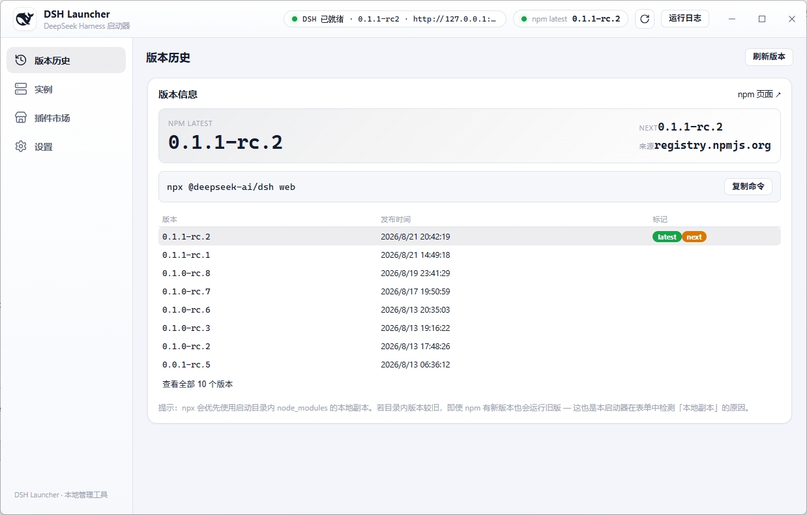
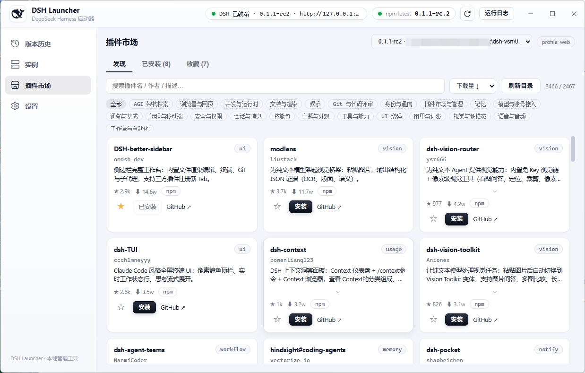

# DSH Launcher

一个 **跨平台桌面 GUI 启动器**（Windows / macOS / Linux），用于以「指定目录 + 指定版本」的方式启动
**DeepSeek Harness（DSH）**，并可视化地查询版本、管理实例、查看实时日志。

DSH 的启动方式本质是一条 `npx -y @deepseek-ai/dsh@<版本> web` 命令（在某个工作目录里运行）。
启动器把「选目录 + 选版本 + 启动/停止 + 看版本」封装成开箱即用的图形界面。

[](https://github.com/wishesl/dsh-launcher/releases)

## 界面预览

**版本历史页**（首页默认打开：npm latest / next、全部版本与发布时间、本地副本对照）：



**插件市场**（发现 / 收藏 / 安装 / 卸载 DSH 插件，操作进度实时展示在右侧面板）：



## 快速上手

1. **准备环境**：运行 DSH 需要 Node.js（推荐 pnpm）；构建本应用需要 [Wails v2 CLI](https://wails.io/docs/gettingstarted/installation) + Go 1.23+。
   Linux 还需系统依赖（Debian/Ubuntu）：`sudo apt install libgtk-3-dev libwebkit2gtk-4.0-dev libayatana-appindicator3-dev librsvg2-dev`
   （Wails v2.10.2 构建需要 webkit2gtk-4.0；Ubuntu 24.04 可再加 `libwebkit2gtk-4.1-dev` 兼容新版）。
   启动器「设置」面板可一键检测 npm / pnpm 是否可用并安装 pnpm。
2. **获取应用**：直接下载 [Releases](https://github.com/wishesl/dsh-launcher/releases) 里对应平台的安装包
   （Windows `dsh-launcher-windows-amd64.exe` / macOS `dsh-launcher-darwin-*.zip` / Linux `dsh-launcher-linux-amd64.tar.gz`，无需安装）；
   或克隆仓库后 `cd dsh-launcher && wails build` 自行构建。
3. **添加实例**：左侧「实例」→「+ 添加实例」→ 选择 DSH 启动目录（例如你的项目目录）→
   选版本（「最新版」或指定版本）→ 启动方式选 **本地副本**（官方推荐，agent 可读真实源码）→ 保存。
4. **启动与打开**：卡片点「启动」，右侧运行日志面板自动弹出并实时滚动；顶部出现
   「DSH 已就绪 · 名称 · 地址」后点它即可在浏览器打开 DSH web（地址也可点卡片 URL 复制）。
5. **安装到目录**：若实例提示「本地副本未安装」，先点卡片「安装到目录」把该版本真实装进
   目录的 `node_modules`，避免 npx 反复联网拉取、也能让 agent 读到源码。
6. **停止 / 重启**：卡片「停止」结束进程；顶部 ↻ 按钮一键重启当前实例。
7. **日常习惯**：点 ✕ 默认最小化到托盘（DSH 继续后台运行），从托盘图标可唤回/退出；
   实例卡片可单独开启「自启」，打开启动器时自动拉起。

> 提示：DSH 本质是 `npx -y @deepseek-ai/dsh@<版本> web` 运行在选定目录里，多个实例互不干扰；
> 一个目录对应一个版本，别混着用（详见 `DSH版本查询与升级指南.md`）。

## 为什么做这个（背景）

参考 `DSH版本查询与升级指南.md`，主要解决两个痛点：

1. **npx 会优先命中启动目录里的本地 `node_modules` 副本**，
   导致「明明 npm 有新版本，本机却一直在跑旧版」。
2. 版本查询/升级要敲一堆命令行（`npm view` / `npx ... web`），容易记错。

启动器的价值：

- 一个实例 = **一个目录 + 一个版本**，多个实例互不干扰（对应指南「版本别混着用」）。
- 可视化显示 **npm 最新版 / 全部版本 / 发布时间 / 本地实际版本**，避免记忆偏差。
- 一键启动/停止，日志实时回显，不再手敲 npx 命令。

## 功能特性

- **实例管理**：每个实例绑定一个目录和一个版本；卡片式列表，带状态指示灯
  （starting / running / ready / stopped / crashed），支持 启动 / 停止 / 删除 / 打开网页。
- **版本查询**：展示 `latest`、`next` dist-tag、全部版本历史与发布时间；
  本地实际版本通过读取 `目录/node_modules/@deepseek-ai/dsh/package.json` 探测。
  版本来源：**官方 registry 优先，npmmirror 兜底**。
- **启动方式**：`npx -y @deepseek-ai/dsh@<version> web`，默认/推荐「本地副本（local）」，
  并支持一键「安装到目录」，避免 npx 反复联网拉取。
- **实时日志**：启动日志流式回显；就绪感知（自动识别 Web 地址）、崩溃与正常退出区分、
  自动启动时日志持久化、退出后清理残留的孤儿 DSH 进程。
- **隐藏到系统托盘**：点窗口 ✕ 默认隐藏到托盘而非退出（可关闭）；托盘图标 + 菜单
  （显示主界面 / 隐藏 / 退出），设置持久化。
- **单点打开（单实例）**：重复启动 exe 不会开第二个窗口/第二个托盘图标，
  只会把已运行实例的窗口唤回前台。
- **前置环境设置**：Settings 面板检测 npm / pnpm 是否可用及版本，可一键安装/升级 pnpm。
- **自启与退出选择**：实例卡片可单独开启「开机自动启动」；点 ✕ 时弹窗选择
  「隐藏到托盘」或「直接退出」。

## 技术栈

| 层 | 技术 |
|---|---|
| 桌面壳 / 后端 | **Wails v2.10.2** + **Go 1.23**（Windows / macOS / Linux 三端） |
| 前端 | **React 18** + **TypeScript** + **Vite 3** |
| 系统托盘 | `fyne.io/systray`（独立 goroutine 跑消息循环，三端通用） |
| 单实例 | Wails `options.SingleInstanceLock` |
| 跨平台进程管理 | 平台抽象层（`procattr_windows.go` / `procattr_unix.go`）：Windows 走 `cmd /c` + Job Object + taskkill；macOS/Linux 走 `sh -c` + Setsid 进程组杀树 |

## 架构与目录结构

```
dsh-launcher/
├── main.go            # 应用入口：窗口/托盘/单实例锁/绑定
├── app.go             # App 生命周期 + 实例增删改查等绑定方法
├── instances.go       # 实例持久化（%APPDATA%\DSHLauncher\instances.json）
├── dsh_query.go       # 版本查询（npm registry / 本地版本探测）
├── dsh_process.go     # 进程管理（npx 启动 / taskkill /T /F 停止 / 日志推送）
├── dsh_job_windows.go # Windows 进程树管理
├── env.go             # 前置环境检测（npm/pnpm）与 pnpm 安装
├── settings.go        # 设置持久化（%APPDATA%\DSHLauncher\settings.json）
├── tray.go            # 系统托盘
└── frontend/
    ├── src/
    │   ├── App.tsx / api.ts / types.ts / util.ts
    │   └── components/
    │       ├── Header.tsx          # 顶栏（最小化到托盘按钮等）
    │       ├── InstanceList.tsx    # 实例列表（固定高度滚动）
    │       ├── InstanceCard.tsx    # 实例卡片（状态灯 / 自启开关 / 打开网页）
    │       ├── InstanceForm.tsx    # 添加实例表单（目录选择 + 版本选择）
    │       ├── VersionPanel.tsx    # 最新版本 / 版本历史面板
    │       ├── LogPanel.tsx        # 运行日志面板
    │       ├── SettingsModal.tsx   # 设置（托盘行为 / 环境检测）
    │       └── ExitDialog.tsx      # ✕ 退出选择弹窗
    └── wailsjs/                    # Wails 自动生成的前端绑定
```

后端通过 `window.go.main.App.*` 暴露绑定方法给前端。

## 开发与构建

前置要求：[Wails v2 CLI](https://wails.io/docs/gettingstarted/installation) + Go 1.23+ + Node.js。

```bash
cd dsh-launcher

# 实时开发模式（前端热更新，Windows 上同样支持 WebView2）
wails dev

# 构建可分发生产包
wails build
```

> 生成的应用名为 `dsh-launcher`（见 `wails.json`）。

### 发布新版本（GitHub Actions 自动编译 + Releases）

推送 `v*` 标签即触发 GitHub Actions 在 **Windows / macOS / Linux** 三个平台自动编译并发布到
[Releases](https://github.com/wishesl/dsh-launcher/releases)：

```bash
git tag v0.1.0
git push origin v0.1.0
```

每次发布自动产出四份产物（附自动生成的更新说明）：

| 平台 | 产物 |
|---|---|
| Windows x64 | `dsh-launcher-windows-amd64.exe` |
| macOS（Apple Silicon） | `dsh-launcher-darwin-arm64.zip` |
| macOS（Intel） | `dsh-launcher-darwin-amd64.zip` |
| Linux x64 | `dsh-launcher-linux-amd64.tar.gz` |

> 提示：产物未做代码签名，Windows SmartScreen / macOS Gatekeeper 首次运行可能提示「未知发布者」，按提示「仍要运行/打开」即可。

## 数据与配置位置

| 内容 | 路径 |
|---|---|
| 实例列表 | `%APPDATA%\DSHLauncher\instances.json` |
| 应用设置（托盘行为、自启等） | `%APPDATA%\DSHLauncher\settings.json` |
| 自动启动日志 | 应用日志目录（`*.log`） |

## 相关文档

- [`需求.md`](需求.md) —— 完整需求与关键决策记录
- [`DSH版本查询与升级指南.md`](DSH版本查询与升级指南.md) —— DSH 版本查询与升级的背景调查
